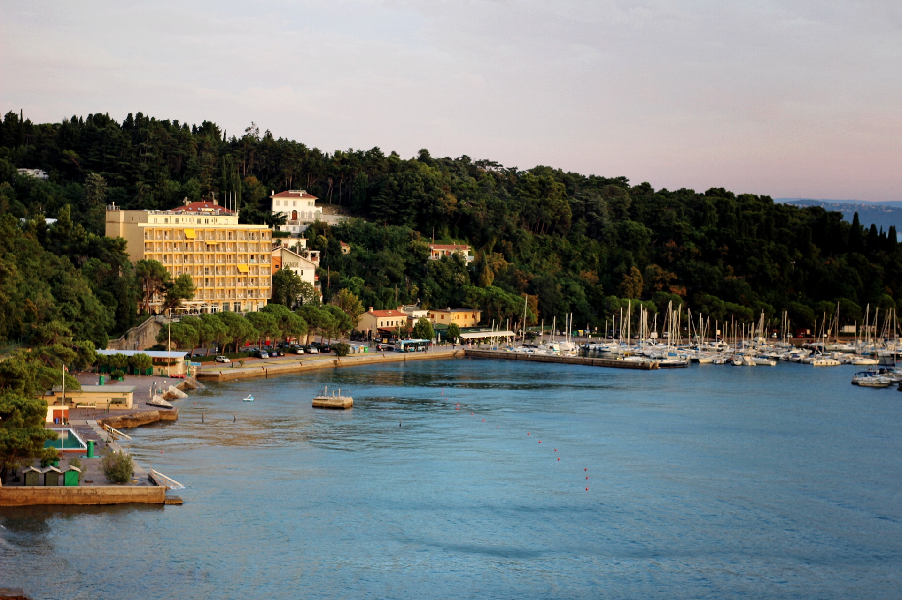

---

The [CODATA-RDA Research Data Science Summer School](http://www.codata.org/working-groups/research-data-science-summer-schools/datatrieste-2019) provides training in the foundational skills of Research Data Science.  Contemporary research – particularly when addressing the most significant, transdisciplinary research challenges – cannot be done effectively without a range of skills relating to data.  

The school is held at the [International Centre for Theoretical Physics](https://www.ictp.it/). The venue, the Adriatico Guest House, is a delightful self-contained site, overlooking the sea,where there is accommodation, lecture halls, a terminal room and a canteen.  

{#id .class width=500}

  
**This year the school will be running a parallel strand that is oriented to
students who are interested in Data Stewardship.** 

The curriculum for these students will be 

* Open Science
* Introduction to Unix Shell
* Programming for Analysis
* Git
* Research Data Management
* Author Carpentry
* Introduction to Information Security
* Metadata & Persistent Identifiers
* Data discovery and automated DMP's
* Repositories
* Ontologies
* Linked data

The first week of the school will be for both Early Career Reseachers (ECR's) and Data Stewards. The seocnd week will break into two parallel strands, one focussing on Data Science techniques for ECR's and the other for Data Stewards. 

The detailed programme can be found [here](./DataTrieste2019Programme/Timetable.html) with a breakdown of the shared and separate courses.

Graduate students or ECR's considering a career in Data Stewardship and Early Career Data Stewards would benefit most from this school.

This school is a part of a planned series of CODATA-RDA schools that will run in Europe as part of the [FAIRsFAIR initiative](https://www.fairsfair.eu).

There is space for 5 students who wish to take the Data Steward strand.
Students wishing to attend this strand will need to cover their accomodation and travel expenses to the school but there are no registration fees. Single rooms at the Adriatico start at €50 per night. 

As this is a pilot students attending this strand will be interviewed afterwards to get feedback to improve the curriculum.

Candidates interested in attending should contact the  director of the Data Steward strand, [Hugh Shanahan](mailto://hugh.shanahan@rhul.ac.uk) before June 1. 
